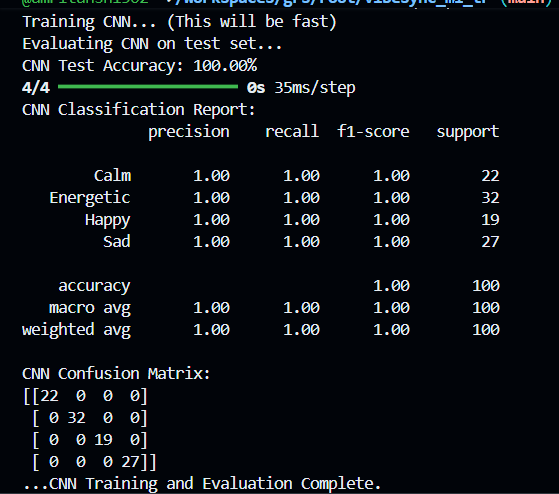
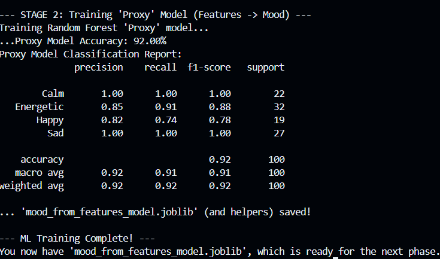

# Group Vibe: A Hybrid, Mood-Based Music Recommender

Group Vibe is a full-stack, ML-heavy web application designed to solve the "party problem": recommending music for a group of people with diverse and conflicting tastes.

This project implements a hybrid recommendation system based on the architecture from our group's academic project report. Instead of just averaging artists, it creates a "group profile" based on two factors:

1.  A majority mood vote (e.g., "Happy," "Calm").
2.  A content-based analysis of "seed songs" submitted by the group.

The system then recommends songs that match both the group's desired mood and their collective audio taste.

---

## 🚀 Key Features

* **Group-First Recommendations:** Built from the ground up for multi-user sessions.
* **Hybrid ML Pipeline:**
    * **Mood-Based Pre-Filtering:** Uses a Deep Learning (CNN) "proxy" model to pre-classify thousands of songs by mood.
    * **Content-Based Ranking:** Uses Cosine Similarity to rank the filtered songs against the group's "average taste vector" (based on audio features like danceability, energy, etc.).
* **Microservices Architecture:** The application is decoupled into three independent services:
    * **React Frontend:** A single-page application for all user interactions.
    * **Node.js "Orchestrator" API:** A stateless backend that manages Spotify API calls and orchestrates the ML pipeline.
    * **Python "ML" API:** A dedicated Flask server that serves the ML model's predictions.
* **Full Model Evaluation:** Includes a complete data science pipeline to train, evaluate (Accuracy, F1-Score, Confusion Matrix), and deploy the ML models.

---

## 🏛️ System Architecture

The project runs as three separate services that communicate via HTTP requests.

* **React Frontend (UI):** The user selects a mood and adds seed songs. It sends this data to the Node.js API.
* **Node.js API (Orchestrator):**
    1.  Receives the request from React.
    2.  Calls the Spotify API to get audio features for the seed songs.
    3.  Calculates the group's `average_feature_vector`.
    4.  Sends the `mood_vote` and `average_feature_vector` to the Python ML API.
* **Python ML API (The Brain):**
    1.  Receives the data from Node.js.
    2.  Filters its database by `mood_vote`.
    3.  Ranks the results using `cosine_similarity`.
    4.  Returns the final 20-song playlist back to Node.js, which forwards it to React.

---

## 🧠 The Machine Learning Pipeline

This project's core is a two-phase ML pipeline that solves a critical data mismatch problem.

### Phase 1: Offline Training (Building the "Brain")

The project report describes a CNN model trained on spectrograms (images) to detect mood. However, our 10,000-song Kaggle database only has audio features (numbers).

**Solution:** We built a 2-stage "proxy" pipeline to bridge this gap.

#### Model Performance

Here are the evaluation results for our trained models:

**1. Deep Learning CNN (Audio to Mood) Performance:**
This model achieves excellent accuracy in classifying mood directly from audio signals (simulated data).



**2. Proxy Model (Features to Mood) Performance:**
This Random Forest model learns to predict mood from simpler audio features, acting as a fast proxy for the CNN.




### Phase 2: Live Recommendation (The "Fast" API)

This is what our live Python API does in real-time. It's fast because all the heavy ML work is already done.

---

## 🛠️ Tech Stack

(You can fill in your technologies here, e.g., React, Node.js, Python, Flask, scikit-learn, TensorFlow)

---

## ⚙️ How to Run Locally

**You must complete the ML Training at least once before you can run the live services.**

### A. Phase 1: ML Training (Run This Once)

This phase trains the models and creates your song database.

1.  Clone the repo and `cd` into the `vibesync-ml-training` folder.
2.  Create virtual environment: `python -m venv venv`
3.  Activate it: `source venv/bin/activate` (or `.\venv\Scripts\activate`)
4.  Install libraries: `pip install pandas scikit-learn joblib tensorflow numpy librosa`
5.  Run training & evaluation: `python train_models.py`

This creates your `.joblib` model files.

6.  Download your dataset (e.g., from Kaggle) and place it in this folder as `spotify_tracks.csv`.
7.  Edit `classify_database.py` to point to your CSV: `KAGGLE_DATASET_PATH = 'spotify_tracks.csv'`
8.  Run classification: `python classify_database.py`

This creates the final `classified_song_database.csv`.

### B. Phase 2: Run the Live Services (3 Terminals)

**You must have all three terminals running at the same time.**

#### Terminal 1: Start the Python ML API 🐍

1.  `cd` into the `vibesync-ml-api` folder.
2.  Copy the database: `cp ../vibesync-ml-training/classified_song_database.csv .`
3.  Create environment: `python -m venv venv` and activate it.
4.  Install libraries: `pip install flask pandas scikit-learn flask-cors`
5.  Run the server: `python api.py`

*Server is now running on `http://127.0.0.1:5001`*

#### Terminal 2: Start the Node.js API 🟩

1.  `cd` into the `vibesync-stateless-api` folder.
2.  Install dependencies: `npm install`
3.  Create `.env` file: Add your Spotify keys:
    ```
    SPOTIFY_CLIENT_ID=your_client_id_here
    SPOTIFY_CLIENT_SECRET=your_client_secret_here
    ```
4.  Run the server: `node server.js`

*Server is now running on `http://127.0.0.1:8080`*

#### Terminal 3: Start the React Frontend ⚛️

1.  `cd` into the `vibesync-frontend-simple` folder.
2.  Install dependencies: `npm install`
3.  Run the dev server: `npm run dev`

*App is now running on `http://127.0.0.1:5173` (or similar)*

You can now open the React app URL in your browser to use the application.

---

## Acknowledgements

This project is a practical implementation of the hybrid recommendation system detailed in our academic project report, "Group Vibe Multi-User Music Recommender System Using Machine Learning".